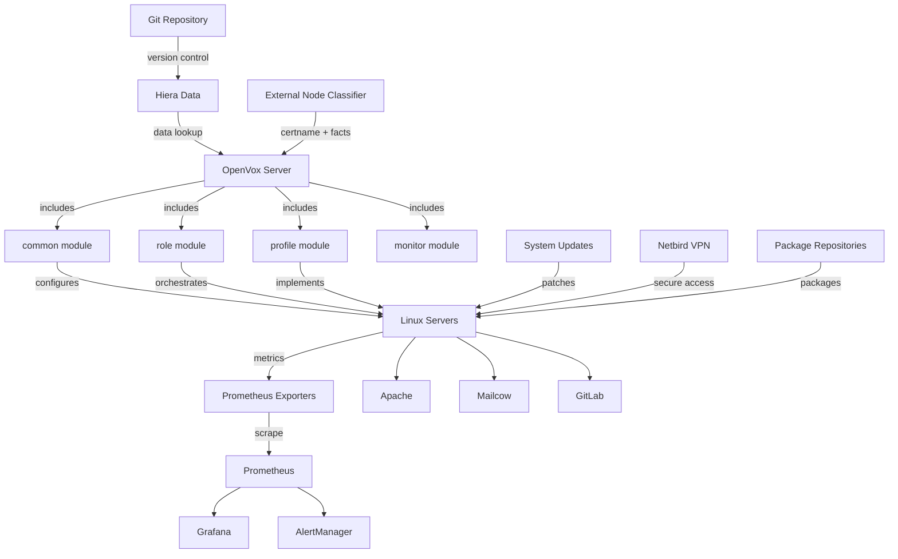

# LinuxAid

LinuxAid is a comprehensive platform for managing secure and reliable Linux operations at scale. Built on OpenVox (an open-source Puppet-compatible configuration management system), LinuxAid provides infrastructure automation, monitoring, and compliance management for enterprise Linux environments. 

## Table of Contents
- [Core Capabilities](#core-capabilities)
- [High-Level Architecture](#high-level-architecture)
  - [Architecture Components](#architecture-components)
- [Key Features & Managed Responsibilities](#key-features--managed-responsibilities)
  - [Data Ownership and Licensing](#10-data-ownership-and-licensing)
- [High Availability](#high-availability)
- [Getting Started](#getting-started)
  - [Adding a New Node](#adding-a-new-node)
- [Documentation](#documentation)

## Core Capabilities

- **Configuration Management**: Automated system configuration using a hierarchical data model (Hiera) with role-based abstractions
- **60+ Pre-configured Applications**: Production-ready deployments for web servers (Apache, HAProxy), email (Mailcow), databases (MySQL, PostgreSQL), CI/CD (GitLab), and more
- **Comprehensive Monitoring**: Automated deployment of 11+ Prometheus exporters with hardware detection, SSL certificate monitoring, and pre-built Grafana dashboards
- **GitOps Workflows**: All configuration changes tracked in Git with change preview capabilities before deployment
- **Supply Chain Security**: Built-in package repository server with GPG signing, staged rollouts, and air-gap support
- **Compliance Frameworks**: Pre-built configurations for GDPR, CIS, and NIS2 compliance
- **Multi-Customer Architecture**: Isolated configuration and subscription-based feature management

**Scale**: LinuxAid is designed to manage from dozens to thousands of nodes, with proven architecture supporting 20,000+ servers.

---

## High-Level Architecture

LinuxAid follows a layered architecture with clear separation between control plane, configuration logic, and managed infrastructure.

### Architecture Components

#### Control Plane
- **OpenVox Server**: Compiles catalogs by combining code from modules with data from Hiera
- **Hiera**: Provides hierarchical data lookup from node-specific overrides to global defaults
- **Git**: All configurations are version-controlled

#### Configuration Modules
- **common module**: Foundation layer providing system baseline (users, SSH, packages, monitoring)
- **profile module**: Implementation layer defining how to deploy specific technologies
- **role module**: Business logic layer defining what services a node should run
- **monitor module**: Observability layer for service health checks and metrics

#### Managed Infrastructure
- Agents pull configurations every 30 minutes (configurable)
- Services are deployed and managed declaratively
- Prometheus exporters automatically deployed based on roles and system facts

#### Monitoring Stack
- **Prometheus**: Scrapes metrics from all exporters
- **Grafana**: Displays pre-built dashboards
- **AlertManager**: Routes alerts based on subscription tier

#### Support Systems
- **Package repositories**: Provide openvox-agent and monitoring exporters
- **Netbird VPN**: Provides secure access without exposing SSH
- **Automated system updates**: With safety checks

---

## Key Features & Managed Responsibilities

The detailed feature breakdown and the managed responsibilities checklist now live in `./docs/features-and-responsibilities.md`. See that page for diagrams, deployment patterns, subscription tiers, operational modes, security/compliance features, monitoring coverage, and the responsibilities matrix.

## Managed Responsibilities Checklist

The full checklist and guidance are available at [https://github.com/Obmondo/LinuxAid/blob/master/docs/features-and-responsibilities.md#managed-responsibilities-checklist](https://github.com/Obmondo/LinuxAid/blob/master/docs/features-and-responsibilities.md#managed-responsibilities-checklist).

### 10. Data Ownership and Licensing

LinuxAid provides true data ownership with no vendor lock-in.

#### 100% Data Ownership

- **Your setup runs on your servers**
- **Infrastructure code remains on your systems**
- **Full control even after subscription ends**
- **No vendor lock-in**
- **Can be hosted on-premises or in any cloud**

#### Deployment Options

| Option | Description | Use Case |
|--------|-------------|----------|
| Single Host | OpenVox server on single Linux server | Small deployments |
| HA Cluster | Multi-node Kubernetes cluster | Production environments |
| Cloud | AWS, Azure, GCP, or any provider | Cloud-native deployments |
| On-Premises | Self-hosted infrastructure | Security/compliance requirements |

The Kubernetes setup is documented in KubeAid and can scale from single-host to multi-node clusters with component-level scaling.

---

## Configuration Options

Under each module that you use in LinuxAid, you can see the documentation in the corresponding `REFERENCE.md` file - following the Puppet standard way of documenting modules.

### LinuxAid Modules

- **[Roles](https://github.com/Obmondo/LinuxAid/blob/master/modules/enableit/role/REFERENCE.md)**: The list of roles (software and configs currently supported). Note: some roles support mixing, but multiple roles cannot always be assigned to a server as they can conflict.

- **[Common Settings](https://github.com/Obmondo/LinuxAid/blob/master/modules/enableit/common/REFERENCE.md)**: The list of common configurations you can roll out for any server, regardless of its configured role.

- **[Monitoring Settings](https://github.com/Obmondo/LinuxAid/blob/master/modules/enableit/monitor/REFERENCE.md)**: Settings for monitoring

### Configuration Scopes

These options can be applied in different scopes:

#### Tags
- Groups defined by OpenVox ENC
- TODO: Document ENC features and custom tag support

#### Facts
- 'Knowledge about a system' - over 7,000 facts available
- Define config for any fact, including:
  - OS, Distribution, software versions installed
  - Location
  - Specific hardware configurations (RAID controller, memory, etc.)
- Filter is adjustable if you want to use facts not enabled by default
- See [Facts documentation](./docs/facts) for details

### Hierarchical Data Management with Hiera

LinuxAid leverages Hiera's hierarchical data lookup system for sophisticated data separation from code.

**Benefits:**
- Same codebase across dev, staging, and production
- Override data at appropriate specificity levels (node, location, OS, etc.)
- Clear separation between code logic and environment-specific data
- Similar flexibility to Helm values in Kubernetes

**View the hierarchy:** <https://github.com/Obmondo/LinuxAid/blob/master/hiera.yaml#L10>

### 60+ Supported Applications

LinuxAid provides out-of-the-box support for 60+ applications, including:
- Web servers (Nginx, Apache, HAProxy)
- Databases (MySQL, PostgreSQL, MongoDB)
- Monitoring tools (Prometheus, Grafana)
- Mail servers (Mailcow)
- VPN solutions (WireGuard)
- And many more

All with pre-configured, production-ready settings that follow best practices.

---

## Proven at Enterprise Scale

The architecture LinuxAid is built on has been proven at massive scale:

### Scale Evidence

| Deployment | Scale | Evidence |
|------------|-------|----------|
| Puppet Enterprise | 20,000+ nodes | Officially documented support |
| GitHub | Thousands of nodes | 500,000+ lines of Puppet code, 200+ contributors |
| Financial Institutions | 30,000+ servers | Major banks in highly regulated environments |
| Enterprise Deployments | 100,000+ servers | Organizations across various industries |

### Why This Architecture Scales

The Puppet/OpenVox architecture provides operational scalability advantages:
- **Declarative configuration**: Define desired state, not steps
- **Change calculation**: Preview all changes before execution
- **Heterogeneous support**: Manage diverse systems with single codebase
- **Operational maturity**: Battle-tested at scale

### LinuxAid Enhancements

While the underlying architecture is proven, LinuxAid adds:
- 60+ pre-configured applications
- Built-in compliance frameworks (GDPR, CIS, NIS2)
- Enterprise-grade monitoring out of the box
- Years of Obmondo's expertise

### Change Confidence at Scale

The change preview capability becomes essential at scale:
- Know exactly what will change before touching production
- Reduce 30,000 servers to 5-7 distinct changeset patterns
- Prevent incidents from untested changes
- Enable confident deployments with multiple contributors

This operational maturity is what enables managing thousands of systems sustainably.

---

## High Availability

LinuxAid runs under a Kubernetes setup (documented in KubeAid) which can be deployed on:
- Single-host Linux server
- Multi-node high availability cluster
- Any cloud provider or on-premises

### Scalable Architecture

The OpenVox Server is written in Clojure with workload separation:
- **Compiler**: Builds configurations (CPU-intensive work)
- **API Layer**: Handles agent communications
- **Independent scaling**: Scale components based on workload

---

## Getting Started

### Adding a New Node

To add a new node to LinuxAid:

1. **Set certname** to `hostname.customer_id` format
2. **Create node file** in `agents/<certname>.yaml` in customer's hiera-data repository
3. **Assign role(s)** via `classes:` parameter to desired role(s)
4. **Run Puppet agent**: `puppet agent -t` to apply initial configuration

---

## Documentation

- [Guides](./docs/guides)
- [Facts](./docs/facts)
- [Monitoring](./docs/monitoring)
- [Roles](./docs/roles)
- [Setup](./docs/setup)
- [Comparison with other IaC tools](./docs/comparisons.md)
- [Contributing](./CONTRIBUTING.md)
