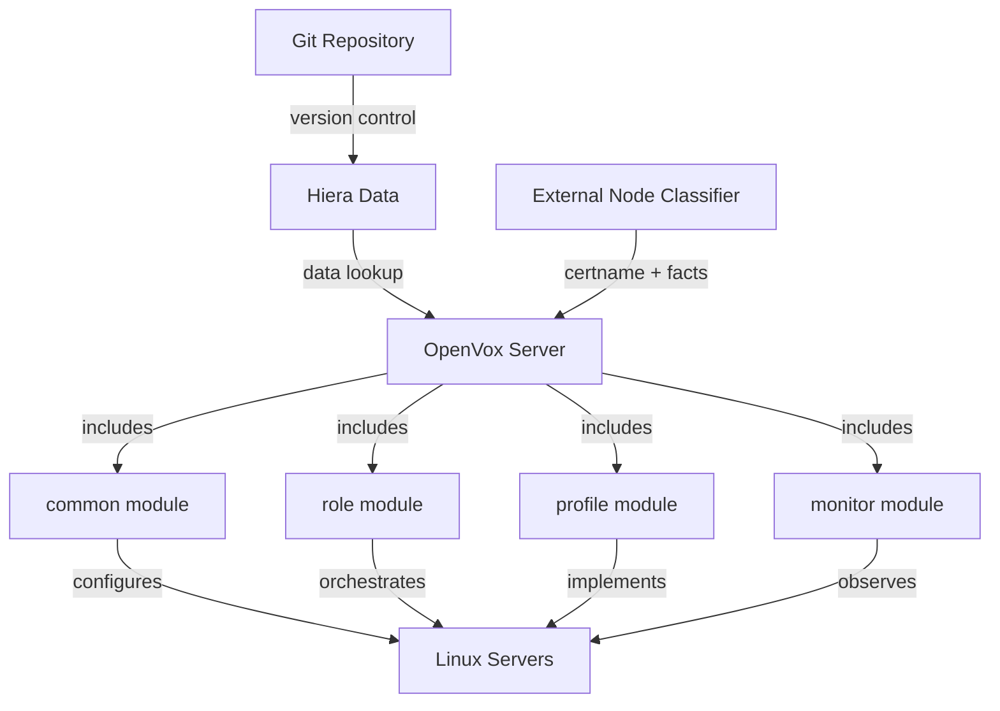

<a href="https://linuxaid.io/">
  <picture>
    <source media="(prefers-color-scheme: dark)" srcset="./docs/images/linuxaid-logo-dark.svg">
    <source media="(prefers-color-scheme: light)" srcset="./docs/images/linuxaid-logo.svg">
    
  </picture>
</a>

**Secure, compliant Linux infrastructure — managed and automated at scale.**

[Website](https://linuxaid.io/) • [How It Works](#how-it-works) • [Getting Started](#getting-started) • [Documentation](#documentation) • [Roles Reference](./modules/enableit/role/REFERENCE.md) • [Contributing](./CONTRIBUTING.md)

LinuxAid is a comprehensive platform for managing secure and reliable Linux operations at scale. Built on **OpenVox** (an open-source, Puppet-compatible configuration management system), LinuxAid provides infrastructure automation, monitoring, and compliance management for enterprise Linux environments — from a handful of servers to fleets of tens of thousands.

Everything is **declarative** and **version-controlled**: infrastructure is defined as code, changes are previewed before they touch production, and the full history lives in Git.

---

## Table of Contents

- [Key Features](#key-features)
- [How It Works](#how-it-works)
  - [Add a Server in 3 Steps](#add-a-server-in-3-steps)
  - [Architecture](#architecture)
- [Managed Responsibilities](#managed-responsibilities)
- [Configuration Options](#configuration-options)
- [Proven at Enterprise Scale](#proven-at-enterprise-scale)
- [High Availability](#high-availability)
- [Supply Chain Security & Repository Management](#supply-chain-security--repository-management)
- [Getting Started](#getting-started)
- [Documentation](#documentation)
- [Contributing](#contributing)
- [License](#license)

---

## Key Features

| Configuration | Monitoring | Security & Compliance | Automation | Platforms |
|---|---|---|---|---|
| ✅ Hierarchical data model (Hiera) | ✅ 11+ Prometheus exporters | ✅ GDPR-ready configurations | ✅ GitOps change preview | ✅ Any Linux distro supported by OpenVox/Puppet |
| ✅ Role-based abstractions | ✅ Auto hardware detection | ✅ CIS benchmark configurations | ✅ Automated system updates with safety checks | ✅ Single-host or multi-node HA (Kubernetes) |
| ✅ [60+ pre-configured applications](#60-supported-applications) | ✅ SSL certificate monitoring | ✅ NIS2 compliance | ✅ Staged, hardlink-based repo rollouts | ✅ Cloud, on-prem, or air-gapped |
| ✅ Multi-customer, isolated configs | ✅ Pre-built Grafana dashboards | ✅ GPG-signed packages | ✅ Agents pull config on a configurable interval | ✅ Subscription-tiered feature management |
| ✅ Data ownership, no vendor lock-in | ✅ AlertManager, tier-based routing | ✅ GPG-verified Git releases | ✅ Auto-deployed exporters based on role/facts | ✅ Secure mesh VPN access (no exposed SSH) |

**Scale**: LinuxAid is designed to manage from dozens to thousands of nodes, on architecture proven to support 20,000+ servers.

---

## How It Works

A lightweight **LinuxAid-Agent** runs on each of your servers. It applies the configuration and security policy you've chosen, then continuously reports health and metrics back to a central monitoring stack. You build your application; LinuxAid handles the rest.

### Add a Server in 3 Steps

| | Step | What happens |
|---|---|---|
| **1** | **Add server** — give it a hostname | Obmondo creates a unique identity for your server |
| **2** | **Choose configuration & subscription** — pick the role it should run | Configuration and support tier are applied to your server |
| **3** | **Run one command as root** | LinuxAid-Agent installs, connects, and starts managing the server |

Works on physical servers, virtual machines, cloud instances, and your own datacenter — on any supported Linux distribution.

### Architecture

The **LinuxAid-Agent** sits between your infrastructure and the monitoring stack. It receives policies and configuration from the control plane, runs exporters locally, and pushes metrics out over a secure channel — so nothing needs to reach *into* your servers.

**What the agent does on each server**

- Collects system, application, and service metrics
- Monitors processes and services, with health checks and status reporting
- Manages configuration and keeps the system in its desired state
- Receives policies and updates from the control plane
- Runs exporters — Node Exporter for system metrics, Security Exporter for CVE scanning
- Sends metrics to Prometheus over a secure, outbound-only channel

**Beyond metrics, LinuxAid also manages**

| | |
|---|---|
| **Service windows** | Schedule and manage maintenance windows with zero downtime |
| **Configuration management** | Enforce desired state and track configuration changes |
| **Security & compliance** | Continuous security scans, CVE reports, and compliance monitoring |
| **Logging** | Centralized logs for better visibility and troubleshooting |

Because configuration is **declarative**, the agent re-checks the server on every run and corrects any drift. Changes are previewed before they reach production, and every change is version-controlled in Git.

<b>Under the hood</b> — OpenVox, Hiera, and the module layers

LinuxAid is built on OpenVox, a Puppet-compatible configuration management system. The agent is an `openvox-agent`; the control plane compiles a catalog for each node and the agent applies it.

```mermaid
graph TB
    git[Git Repository]
    hiera[Hiera Data]
    enc[External Node Classifier]
    openvox[OpenVox Server]

    common[common module]
    role[role module]
    profile[profile module]
    monitor[monitor module]

    linux_servers[Linux Servers]

    git -->|version control| hiera
    hiera -->|data lookup| openvox
    enc -->|certname + facts| openvox

    openvox -->|includes| common
    openvox -->|includes| role
    openvox -->|includes| profile
    openvox -->|includes| monitor

    common -->|configures| linux_servers
    role -->|orchestrates| linux_servers
    profile -->|implements| linux_servers
    monitor -->|observes| linux_servers
```

**Control plane**
- **OpenVox Server** — compiles catalogs by combining module code with Hiera data
- **Hiera** — hierarchical data lookup, from node-specific overrides down to global defaults
- **External Node Classifier** — resolves a node's certname and facts into its classes and data
- **Git** — all configuration is version-controlled

**Configuration module layers**
- **common** — foundation layer: system baseline (users, SSH, packages, monitoring)
- **profile** — implementation layer: *how* to deploy a specific technology
- **role** — business logic layer: *what* services a node should run
- **monitor** — observability layer: service health checks and metrics

**Managed infrastructure**
- Agents pull configuration every 30 minutes (configurable)
- Services are deployed and managed declaratively
- Prometheus exporters are deployed automatically based on roles and system facts

**Support systems**
- **Package repositories** — serve openvox-agent and monitoring exporters
- **Netbird VPN** — secure node access without exposing SSH
- **Automated system updates** — applied with safety checks

---

## Managed Responsibilities

The detailed feature breakdown and managed-responsibilities checklist — deployment patterns, subscription tiers, operational modes, security/compliance coverage, and the full responsibilities matrix — live in [`docs/features-and-responsibilities.md`](./docs/features-and-responsibilities.md).

### Data Ownership and Licensing

LinuxAid provides true data ownership with no vendor lock-in:

- Your setup runs on **your** servers
- Infrastructure code remains on your systems
- Full control even after subscription ends
- Can be hosted on-premises or in any cloud

| Deployment Option | Description | Use Case |
|---|---|---|
| Single Host | OpenVox server on a single Linux server | Small deployments |
| HA Cluster | Multi-node Kubernetes cluster | Production environments |
| Cloud | AWS, Azure, GCP, or any provider | Cloud-native deployments |
| On-Premises | Self-hosted infrastructure | Security/compliance requirements |

The Kubernetes setup is documented in KubeAid and can scale from single-host to multi-node clusters with component-level scaling.

---

## Configuration Options

Every module used by LinuxAid documents its parameters in a `REFERENCE.md` file, following the standard Puppet module documentation convention.

### LinuxAid Modules

- **[Roles](./modules/enableit/role/REFERENCE.md)** — the list of roles (software and configs currently supported). Some roles support mixing, but multiple roles cannot always be assigned to a server as they can conflict.
- **[Common Settings](./modules/enableit/common/REFERENCE.md)** — configurations that can be rolled out to any server, regardless of its role.
- **[Monitoring Settings](./modules/enableit/monitor/REFERENCE.md)** — settings for monitoring.

### Configuration Scopes

Options can be applied at different scopes:

- **Tags** — groups defined by the OpenVox ENC
- **Facts** — over 7,000 available facts (OS/distribution/software versions, location, hardware configuration, etc.). See [Facts documentation](./docs/facts) for details.

### Hierarchical Data Management with Hiera

LinuxAid leverages Hiera's hierarchical data lookup system to separate data from code:

- Same codebase across dev, staging, and production
- Override data at the appropriate specificity level (node, location, OS, etc.)
- Clear separation between code logic and environment-specific data
- Similar flexibility to Helm values in Kubernetes

See [`hiera.yaml`](./hiera.yaml) for the full hierarchy configuration, starting at the `hierarchy:` section.

### 60+ Supported Applications

LinuxAid ships out-of-the-box, production-ready support for 60+ applications, including:

- Web servers — Nginx, Apache, HAProxy
- Databases — MySQL, PostgreSQL, MongoDB
- Monitoring — Prometheus, Grafana
- Mail servers — Mailcow
- VPN — WireGuard
- CI/CD — GitLab
- ...and many more, all pre-configured to follow best practices.

---

## Proven at Enterprise Scale

The Puppet/OpenVox architecture LinuxAid is built on has been proven at massive scale:

| Deployment | Scale | Evidence |
|---|---|---|
| Puppet Enterprise | 20,000+ nodes | Officially documented support |
| GitHub | Thousands of nodes | 500,000+ lines of Puppet code, 200+ contributors |
| Financial Institutions | 30,000+ servers | Major banks in highly regulated environments |
| Enterprise Deployments | 100,000+ servers | Organizations across various industries |

**Why this architecture scales:**
- **Declarative configuration** — define desired state, not steps
- **Change calculation** — preview all changes before execution
- **Heterogeneous support** — manage diverse systems with a single codebase
- **Operational maturity** — battle-tested at scale

**What LinuxAid adds on top:**
- 60+ pre-configured applications
- Built-in compliance frameworks (GDPR, CIS, NIS2)
- Enterprise-grade monitoring out of the box
- Years of Obmondo's operational expertise

At scale, change-preview capability becomes essential: it can reduce 30,000 servers to 5–7 distinct changeset patterns, preventing incidents from untested changes and enabling confident deployments with multiple contributors.

---

## High Availability

LinuxAid runs under a Kubernetes setup (documented in KubeAid), deployable on:

- A single-host Linux server
- A multi-node high-availability cluster
- Any cloud provider or on-premises

The OpenVox Server is written in Clojure with workload separation:

- **Compiler** — builds configurations (CPU-intensive work)
- **API Layer** — handles agent communications
- **Independent scaling** — scale components based on workload

---

## Supply Chain Security & Repository Management

LinuxAid includes built-in supply chain protection and package repository management:

- **Air-Gapped Operation** — package repository mirroring lets servers operate securely without direct internet connectivity
- **Automated GPG Package Signing** — the `packagesign` daemon pulls RPM/Deb packages built by CI/CD, GPG-signs them, and publishes them to trusted repositories
- **GPG Git Verification** — protects against compromised Git hosts by verifying GPG signatures on release branches before CI runners execute build pipelines
- **Staged Snapshot Rollouts** — hardlink-based repository snapshots let security updates be staged and rolled out to server groups incrementally

---

## Getting Started

### Adding a New Node

1. **Set certname** to `hostname.customer_id` format
2. **Create node file** in `agents/<certname>.yaml` in the customer's hiera-data repository
3. **Assign role(s)** via the `classes:` parameter
4. **Run the Puppet agent**: `puppet agent -t` to apply the initial configuration

Node classification is handled by the External Node Classifier (see [`puppet_enc.rb`](./puppet_enc.rb)), which resolves the certname and facts into the classes and Hiera data for that node.

To connect your Git hosting platform to your Obmondo environment, see the [Git Setup guide](./docs/setup/git_setup.md).

---

## Documentation

### Setup & Operations

| Guide | Description |
|---|---|
| [Git Setup](./docs/setup/git_setup.md) | Connect your Git hosting platform to your Obmondo environment |
| [Netbird VPN](./docs/guides/netbird-install.md) | Secure node mesh VPN setup |
| [Eyaml Secrets](./docs/guides/eyaml.md) | Encrypted Hiera data management |
| [Updates](./docs/guides/updates.md) | Updating Puppet modules and the Puppetfile |
| [Release Process](./docs/guides/release.md) | Tagging and publishing a LinuxAid release |
| [Turris Install](./docs/guides/linuxaid-turris-install.md) | Installing LinuxAid on Turris routers with Netbird |

### Monitoring & Security

| Guide | Description |
|---|---|
| [Monitoring](./docs/monitoring/monitoring.md) | Kube Prometheus stack, Grafana, and alerting |
| [Puppetboard](./docs/guides/puppetboard.md) | Web dashboard for OpenVox/Puppet |
| [OpenVAS Setup](./docs/openvas-setup-guide.md) | Greenbone vulnerability scanner deployment |
| [ZFS Replication](./docs/guides/zfs-replication-using-sanoid.md) | Sanoid/Syncoid automated ZFS backup setup |

### Reference

| Reference | Description |
|---|---|
| [Roles](./docs/roles) | Pre-configured application roles |
| [Facts](./docs/facts) | Fact-based configuration targeting |
| [Features & Responsibilities](./docs/features-and-responsibilities.md) | Feature matrix and operational scope |
| [IaC Comparisons](./docs/comparisons.md) | Architectural comparison vs. Ansible, Terraform, Puppet |
| [Generating Docs](./docs/guides/generate-docs.md) | Regenerating module REFERENCE.md with Puppet Strings |

---

## Contributing

Contributions are welcome. Please read [`CONTRIBUTING.md`](./CONTRIBUTING.md) for the development workflow, and [`CODE_OF_CONDUCT.md`](./CODE_OF_CONDUCT.md) (DPGA-compliant) before opening issues or pull requests.

## License

LinuxAid is licensed under the [GNU Affero General Public License v3.0](./LICENSE).
