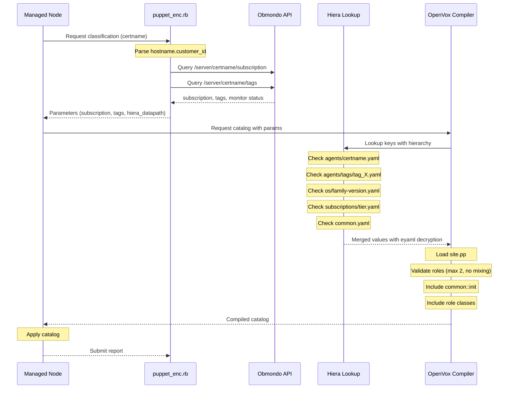

# Key Features and Managed Responsibilities

## Key Features of LinuxAid

### 1. Configuration Management

LinuxAid uses a sophisticated hierarchical configuration system that separates code from data.

#### Key Configuration Components

| Component | Purpose |
|-----------|---------|
| External Node Classifier | Parse certname, query API, set parameters |
| Site Manifest | Role validation and class inclusion |
| Common Module | System baseline and defaults |

#### Hiera Hierarchy Levels

Priority from highest to lowest:

1. **Node-specific**: `agents/<certname>.yaml` - Overrides for individual servers
2. **Tags**: `agents/tags/<tag>/*.yaml` - Group-based configuration (up to 10 tags per node)
3. **Facts**: `facts/os.family=<family>.yaml` - OS and hardware-specific settings
4. **Subscription**: `subscriptions/<tier>.yaml` - Feature sets per subscription level
5. **Global**: `common.yaml` - Default values for all nodes

#### Benefits

- Same codebase across development, staging, and production
- Override data at appropriate specificity levels
- Clear separation between code logic and environment data
- Encrypted secrets via `eyaml` throughout the hierarchy

---

### 2. Service Deployment (60+ Applications)

LinuxAid provides pre-configured, production-ready deployments for a wide range of applications.

#### Supported Application Categories

| Category | Examples | Implementation |
|----------|----------|----------------|
| Web Servers | Apache, HAProxy | `role::web::apache`, `role::web::haproxy` |
| Email Systems | Mailcow (full stack) | `role::mail::mailcow` with 12+ Docker containers |
| Databases | MySQL, PostgreSQL, MongoDB | `role::db::mysql`, `role::db::postgresql` |
| CI/CD | GitLab Server, GitLab Runners | `role::projectmanagement::gitlab` |
| Package Management | APT/YUM repository server | `role::package_management::repo` |
| VPN | WireGuard, Netbird | `common::network::wireguard`, `common::network::netbird` |
| Load Balancing | HAProxy with DDoS protection | `eit_haproxy::basic_config` |
| Monitoring | Prometheus, Grafana, AlertManager | KubeAid ([Prometheus UI](http://prometheus.obmondo.com)) |

#### Deployment Pattern: Role-Profile-Common

All services follow this three-layer pattern:

- **Role**: Defines what the service does (business logic)
- **Profile**: Defines how to deploy the service (implementation)
- **Common**: Provides foundation (certs, monitoring, firewall)

**Example - Apache deployment integrates:**
- SSL certificate management via `common::certs`
- Automatic monitoring via `monitor::domains`
- Firewall rules via `firewall_multi`
- Virtual host configuration with module management

---

### 3. Calculate Changes Before Deployment

**One of LinuxAid's most powerful capabilities** is the ability to calculate and preview ALL changes that any code modification will cause across your entire infrastructure, without touching a single server.

#### How It Works

When managing 30,000 servers, you can:

1. **Make a code change** in your configuration repository
2. **Calculate changesets** automatically for all nodes
3. **Preview detailed impact** - see exactly what will change on each server with the diff
4. **Group by pattern** - reduce 30,000 servers to 5-7 distinct changeset patterns
5. **Review before deployment** - know precisely which servers will be affected and how

#### Real-World Benefits

**Before making any changes to production, you know:**
- Exactly what will change on each server
- Which servers will be affected
- How many distinct change patterns exist
- Whether your change will have unintended consequences

**Comparison:**

**Traditional approach (Ansible, manual scripting):**
1. Run playbook against production
2. Discover it changed unexpected systems
3. Roll back manually
4. Debug what went wrong
5. Try again

**LinuxAid approach:**
1. Review changeset calculation
2. See exactly what will change and where
3. Approve or reject before any server is touched
4. Deploy with confidence

#### When This Use Case is Beneficial

- Managing thousands of heterogeneous systems
- Working with multiple contributors on the same codebase
- Meeting compliance requirements that demand change documentation
- Preventing production incidents from untested changes

---

### 4. GitOps and Change Management

LinuxAid was built for centralized management and GitOps workflows.

#### GitOps Benefits

| Feature | Description | Benefit |
|---------|-------------|---------|
| Complete Audit Trail | All changes logged in Git | Required by ISO 27001, ITILv4, NIS2 |
| Change Preview | Noop mode before deployment | See exactly what will change |
| Branch-Based Development | Feature branches for testing | No separate test infrastructure needed |
| Pull Request Workflow | Standardized code review | Operations follows software development practices |
| No Direct SSH | All changes via central server | Prevents undocumented manual changes |

#### Key Features

- **Changelog of everything done on your systems**
  - Required by ISO 27001:2022, ITILv4, and regulations worldwide including NIS2

- **All changes through central server**
  - All changes flow through the central LinuxAid server
  - Complete logging and auditability
  - No direct SSH to systems for "quick fixes"
  - Prevents the anti-pattern of undocumented manual changes

- **Branch-based development and testing**
  - Develop features in feature branches
  - Calculate changes against real systems using branch-specific configurations
  - Merge to main only after validation
  - No need to maintain separate test infrastructure

- **Standardized code review methods for operations**
  - Everything's a Pull Request now

- **Supply Chain Security on operations**
  - GPG signing feature

---

### 5. Subscription-Based Feature Management

LinuxAid uses a subscription tier system to control feature availability and support levels.

#### Subscription Tiers

| Tier | Features |
|------|----------|
| basic | System updates, obmondo-admin user, sudo management |
| bronze | All basic features + enhanced support |
| silver | All bronze features + advanced features |
| gold | All silver features + premium features |
| platinum | All gold features + dedicated support |

#### Features Enabled Across All Tiers

All subscription tiers automatically enable:
- `common::system::updates` class with safety checks
- `obmondo_monitoring_status=true`

---

### 6. Full Host Management vs. Minimal Setup

LinuxAid supports two operational modes controlled by the `common::full_host_management` parameter.

#### Full Host Management (default: `true`)

When enabled, LinuxAid manages all aspects of the system:

| Subsystem | Classes Included | Purpose |
|-----------|------------------|---------|
| Logging | `common::logging` | Rsyslog and logrotate configuration |
| Backup | `common::backup` | Backup strategies for services |
| Cron | `common::cron` | Cron job management |
| Repository | `common::repo` | Package repository configuration |
| Certificates | `common::certs` | SSL/TLS certificate management |
| Packages | `common::package` | System package installation |
| System Config | `common::system` | Users, SSH, kernel, systemd |
| Software | `common::software` | Additional software installations |
| Virtualization | `common::virtualization` | Docker, LXC support |
| Storage | `common::storage` | ZFS, NFS, Samba |
| Network | `common::network` | Network interfaces, firewall, VPN |
| Services | `common::services` | Service management |
| Security | `common::security` | Security policies |
| Mail | `common::mail` | Mail relay (unless role::mailcow used) |

#### Minimal Setup (`full_host_management=false`)

Used for special-purpose nodes (e.g., TurrisOS routers, monitoring-only nodes).

**Always included regardless of `full_host_management`:**
- `common::setup` - Obmondo admin user setup
- `common::openvox` - OpenVox agent configuration
- `common::monitor` - Monitoring exporter deployment
- `common::monitoring` - Monitoring daemons
- `common::hosts` - Host file management

---

### 7. Security and Compliance

LinuxAid includes comprehensive security features and compliance frameworks.

#### Security Features

| Feature | Implementation | Purpose |
|---------|----------------|---------|
| Certificate Management | `common::certs` | Manual and Let's Encrypt certificates |
| Firewall | `firewall_multi` | Declarative firewall rules |
| VPN Access | Netbird | Secure access without SSH exposure |
| Encrypted Secrets | eyaml | Encrypted data in Hiera |
| User Management | `common::system::users` | Centralized user accounts |
| Sudo Management | `common::system::authentication::sudo` | Controlled privilege escalation |
| SELinux | `common::system::selinux` | Mandatory access control |
| Auditd | `common::security::auditd` | System auditing |

#### Compliance Frameworks

LinuxAid provides pre-built configurations for:
- **GDPR**: Data protection and privacy
- **CIS**: Security benchmarks
- **NIS2**: Network and information security

All changes are tracked in Git for audit trails required by ISO 27001, ITILv4, and compliance regulations.

---

### 8. Supply Chain Security

LinuxAid provides an open source repository server for supply chain security.

#### Features

- **Mirror any upstream repository** for air-gapped operations
- **Servers don't need internet access** to function
- **Automatic snapshots** for staged rollouts (hardlink-based for efficiency)
- **Built-in packagesign daemon** for GPG signing packages

#### Protection Against Single-Point-of-Compromise

See [CONTRIBUTING.md](../CONTRIBUTING.md) for details.

#### Staged Rollouts

Using LinuxAid's repository server:
1. Enable automatic snapshots
2. Split servers into groups
3. Assign snapshots to one group at a time
4. Roll out security updates progressively

You can do the same for your LinuxAid configuration (hiera tree) by using git branches or tags and locking servers to specific environments.

---

### 9. Monitoring and Observability

LinuxAid includes comprehensive monitoring for all hardware and software components.

#### Automatic Deployment

LinuxAid automatically detects your hardware and system configuration using 'facts' (1000+ available), then configures appropriate monitoring for your specific setup.

#### Observability Stack

- **Prometheus**: Metrics tracking
- **Grafana**: Pre-built dashboards
- **AlertManager**: Custom rules and pre-defined thresholds

#### Key Capabilities

- 6 default exporters on all nodes
- Hardware detection via facts
- SSL certificate expiry tracking
- Blackbox HTTP/HTTPS probing
- Service health monitoring
- Automatic exporter deployment based on roles

See [monitoring documentation](https://github.com/Obmondo/LinuxAid/blob/master/docs/monitoring/monitoring.md) for technical details.

---

## Managed Responsibilities Checklist

| Responsibility | Coverage | Details |
|----------------|----------|---------|
| Monitoring & alerting | ✅ Default when `role::monitoring` is applied | [See Monitoring & Alerting](#monitoring--alerting) |
| Backups & restores | ⚠️ Collaborative engagement | [See Backups & Restores](#backups--restores) |
| Security updates | ⚠️ Requires `common::full_host_management=true` | [See Security Updates](#security-updates) |
| Performance tuning | ⚠️ Delivered via service engagement | [See Performance Tuning](#performance-tuning) |

Each checklist row links to a section below that explains what LinuxAid delivers out of the box versus what we coordinate with you.

### Monitoring & Alerting

- Existing systems: Apply `role::monitoring` and we deploy exporters plus alert routing; with an active subscription those alerts flow to LinuxAid by default.
- Customer-managed Prometheus: You can point exporters at your Prometheus instance; otherwise we provision a managed Prometheus/Grafana stack so you can get started immediately.
- Preview vs. apply: Run `puppet agent -t --noop` to review what would change on a node, then run `puppet agent -t --no-noop` to enforce configuration (dropping the flag also applies). This makes it easy to calculate changes before deployment and keep everything logged in Git.

### Backups & Restores

- Fresh LinuxAid builds (“empty” nodes configured only via roles/profiles) inherit the backup policies baked into those roles.
- For existing workloads we work with you to define backup frequency, retention, and restore objectives; once documented we can own the procedures end-to-end.
- Backup policies align with our ISO 27001/NIS2 controls. Refer to the representative specification at [compliance_doc.md](https://linuxaid.io) for schedule guidance.

### Security Updates

- LinuxAid manages OS/application updates, including third-party repositories, when `common::full_host_management` is enabled so we control package sources and maintenance windows.
- We recommend deploying the `role::package_management::repo` repository server so patches flow through a trusted, GPG-signed channel (details at [https://gitea.obmondo.com/EnableIT/LinuxAid#security-and-reliability](https://gitea.obmondo.com/EnableIT/LinuxAid#security-and-reliability)).
- Snapshot-based staged rollouts (see [Supply Chain Security](#8-supply-chain-security)) let us roll updates across fleets without downtime.

### Performance Tuning

- Baseline tuning (kernel, sysctl, filesystem, JVM, database parameters, etc.) is encoded in the relevant profile classes.
- For advanced tuning we analyze telemetry (either from the LinuxAid-managed Prometheus or a customer-provided stack) and co-own remediation plans with your team.
- All tuning changes flow through Git-based change management, keeping ISO 27001/NIS2 evidence intact.

