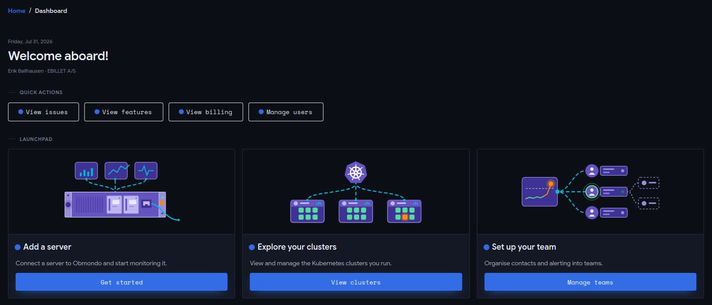
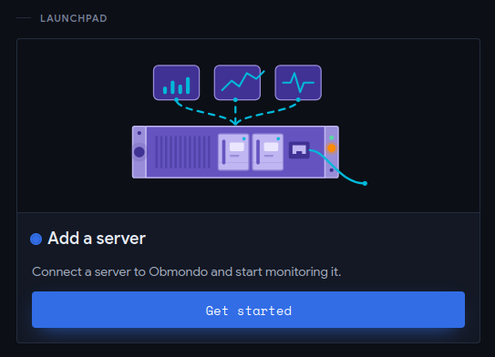

# Linuxaid installation for TurrisOS

## Installing Linuxaid on Turris routers with Netbird integration

### The Updated Approach (using Obmondo UI)

1. Login to Obmondo UI, to go to the dashboard page.

    ```text
    https://obmondo.com/dashboard
    ```

    

2. Click on `Get started` to `Add a server`.  

    

3. Click on `+ Add Server`, and enter your server (in our case it's the turris router) name by following the below naming conventions:

    `turris-{server-name}`

    > NOTE: Please ensure the `{server-name}` is unique, since it will generate certname in `{server-name}.{customer-id}` format.

4. Copy the shell command provided in the Linuxaid installation wizard, and run it in your turris router. This setup is fully automated, and will install and configure linuxaid on your router.

5. Once the setup completes, go back to Obmondo UI, and continue the next steps to complete the installation wizard. A PR will be created for the turris router in linuxaid-config repo. (You don't need to worry about it. We'll handle the PR from our side.)

6. In Obmondo UI, go to tags page, and add your router in correct tag (based on what you did in the step 2). If the tag doesn't already exist, you can create one and add the turris router as a member.

    ```text
    https://obmondo.com/customer/tags
    ```

    | Type | Naming Convention |
    | :--- | :--- |
    | HQ | `netbird-hq` |
    | Cinema | `netbird-cinema` |

7. Wait for a couple of mins until the cache refreshes, and then run puppet in your turris router in no-noop mode. This will apply all the necessary configurations, and install and configure netbird as well.

    ```sh
    puppet agent -t --no-noop
    ```

8. Verify if netbird is successfully installed.

    ```sh
    netbird status
    ```

9. Login to netbird VPN page, and check if the turris router shows up in the peer section.

    ```text
    https://vpn.example.com
    ```

    > NOTE: This is just an example URL. Use your actual netbird VPN URL, or reach out to us at [ops@obmondo.com](mailto:ops@obmondo.com)
