# TurrisOS Router Installation & Netbird VPN Integration

## Prerequisites

Before starting, ensure you have:

- An active account and access on the [Obmondo UI](https://obmondo.com/).
- Completed the [Git setup guide](../../docs/setup/git_setup.md).
- A TurrisOS router powered on, connected to your network, with root SSH access enabled (SSH port 22 enabled via the Turris management panel/LuCI/Foris, and the router's LAN IPv4 address available).

## Installing Linuxaid on TurrisOS Routers

1. Login to Obmondo UI, go to the servers page.

    ```text
    https://obmondo.com/user/servers
    ```

    <a href="https://obmondo.com/user/servers">
        <picture>
            <source media="(prefers-color-scheme: dark)" srcset="../images/obmondo-user-servers-dark.png">
            <source media="(prefers-color-scheme: light)" srcset="../images/obmondo-user-servers-light.png">
            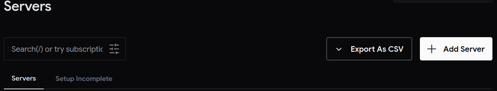
        </picture>
    </a>

2. Click on `+ Add Server`, and enter your server name (in our case, the `TurrisOS` router) following the naming convention:

    `turris-{server-name}`

    <a href="https://obmondo.com/user/servers/add-server">
        <picture>
            <source media="(prefers-color-scheme: dark)" srcset="../images/obmondo-add-turris-server-dark.png">
            <source media="(prefers-color-scheme: light)" srcset="../images/obmondo-add-turris-server-light.png">
            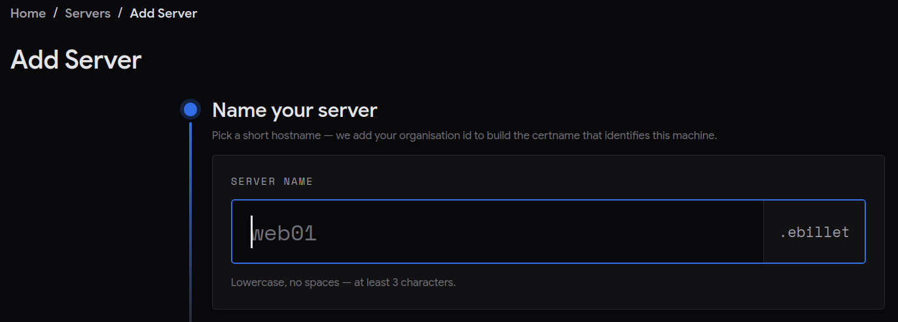
        </picture>
    </a>

    > NOTE: Please ensure the `{server-name}` is unique, since it will generate a certname in the format `turris-{server-name}.{customer-id}`.
    > For example, you can use unique location/network names such as `turris-filmtraefdisk`, `turris-ebillethq-soeborg`, etc.

3. In the next step, choose the `Basic` role, since we only want basic and essential services configured for Linuxaid to run properly on the `TurrisOS` router.

4. Before running the installation command, ensure that root SSH access and port 22 are enabled on your TurrisOS router by following these steps:

    1. From your workstation, open the Turris LuCI admin dashboard in your web browser and enter your credentials and click **Login**:

       ```text
       http://{network-address}/cgi-bin/luci/admin/dashboard
       ```

       ```txt
       Username: root
       Password: your admin password
       ```

        <picture>
            <source media="(prefers-color-scheme: dark)" srcset="../images/turris-login.png">
            <source media="(prefers-color-scheme: light)" srcset="../images/turris-login.png">
            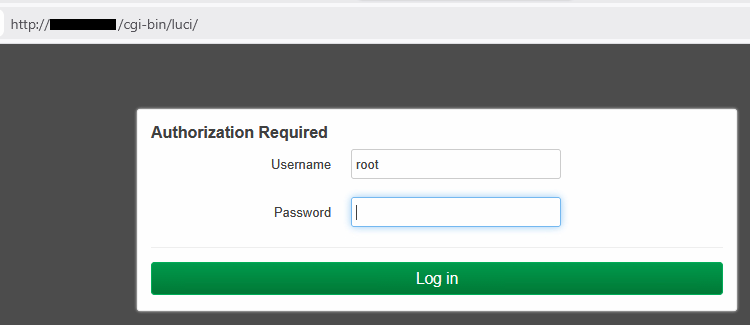
        </picture>

       *(Note: `{network-address}` is the corresponding network address for your unique location/network).*

    2. After a successful login, locate the `Internet` section on the dashboard where you will see your router's `IPv4` address - this is the IP address you will use to SSH into the TurrisOS router.

        <picture>
            <source media="(prefers-color-scheme: dark)" srcset="../images/turris-ipv4.png">
            <source media="(prefers-color-scheme: light)" srcset="../images/turris-ipv4.png">
            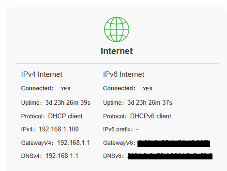
        </picture>

    3. From the top navigation menu, go to **Network** and click on **Firewall**.

        <picture>
            <source media="(prefers-color-scheme: dark)" srcset="../images/turris-firewall.png">
            <source media="(prefers-color-scheme: light)" srcset="../images/turris-firewall.png">
            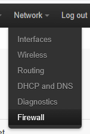
        </picture>

    4. Go to the **Traffic Rules** tab and search for `port 22`. Ensure that the `Enabled` checkbox is ticked.

        <picture>
            <source media="(prefers-color-scheme: dark)" srcset="../images/turris-traffic-rules.png">
            <source media="(prefers-color-scheme: light)" srcset="../images/turris-traffic-rules.png">
            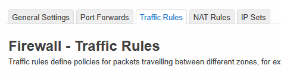
        </picture>

        <picture>
            <source media="(prefers-color-scheme: dark)" srcset="../images/turris-enable-ssh.png">
            <source media="(prefers-color-scheme: light)" srcset="../images/turris-enable-ssh.png">
            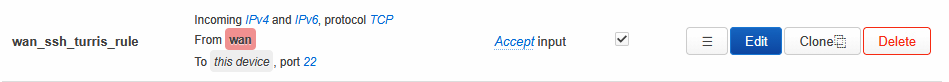
        </picture>

    5. Click **Save and Apply** at the bottom of the page. The router will probably restart to apply the changes. Let it restart.

        <picture>
            <source media="(prefers-color-scheme: dark)" srcset="../images/turris-apply-changes.png">
            <source media="(prefers-color-scheme: light)" srcset="../images/turris-apply-changes.png">
            
        </picture>

    6. Open your terminal (or Powershell) and connect to your TurrisOS router as the `root` user using the router's IPv4 address:

       ```sh
       ssh root@<router-ip>
       ```

    7. Copy and run the installation command provided on the final step of the Linuxaid installation wizard. This setup is fully automated and will install and configure Linuxaid on your router.

5. Once the Linuxaid setup completes on the TurrisOS router, log in to your Git hosting platform (e.g., GitHub/GitLab/Azure DevOps), open your `linuxaid-config` repository (configured during Git setup), and navigate to the **Pull Requests** section. You will see a prompt suggesting a new PR created from the newly added router's branch. Create the pull request and merge the changes into your `default` (or `main`) branch.

6. In the Obmondo UI, go to the tags page and add your `TurrisOS` router as a member of the appropriate tag (based on your naming/location convention). If the tag does not exist, create one and add the router as a member.

    ```text
    https://obmondo.com/user/servers/config-tag
    ```

    | Type | Naming Convention |
    | :--- | :--- |
    | HQ | `netbird-hq` |
    | Cinema | `netbird-cinema` |

    <a href="https://obmondo.com/user/servers/config-tag">
        <picture>
            <source media="(prefers-color-scheme: dark)" srcset="../images/obmondo-configure-netbird-tags-dark.png">
            <source media="(prefers-color-scheme: light)" srcset="../images/obmondo-configure-netbird-tags-light.png">
            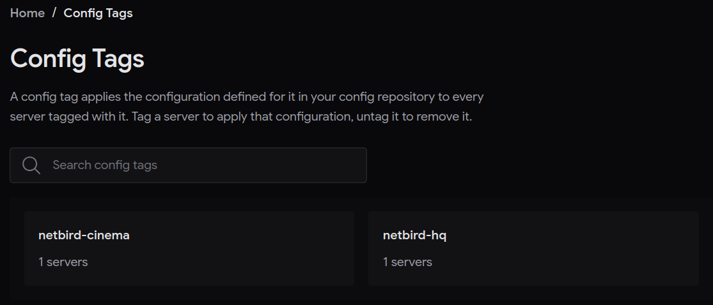
        </picture>
    </a>

7. Wait a couple of minutes for the cache to refresh, then return to your TurrisOS router via SSH and run the puppet agent in no-noop mode. This applies all necessary configurations and installs/configures Netbird:

    ```sh
    puppet agent -t --no-noop
    ```

8. Verify that Netbird has been successfully installed:

    ```sh
    netbird status
    ```

9. Log in to your self-hosted Netbird VPN dashboard and check that the `TurrisOS` router appears in the peer section:

    ```text
    https://vpn.example.com
    ```

    > NOTE: This is an example URL. Use your actual Netbird VPN URL, or reach out to us at [ops@obmondo.com](mailto:ops@obmondo.com).

## Setting up Netbird on Workstation Machines (e.g., Windows)

Once the TurrisOS router gateway is configured and connected to Netbird, you can connect workstation machines to the secure network.

1. Visit the official Netbird website and download the latest installer by clicking `Download Netbird`:

    ```text
    https://app.netbird.io/install
    ```

    <picture>
        <source media="(prefers-color-scheme: dark)" srcset="../images/netbird-download-installer.png">
        <source media="(prefers-color-scheme: light)" srcset="../images/netbird-download-installer.png">
        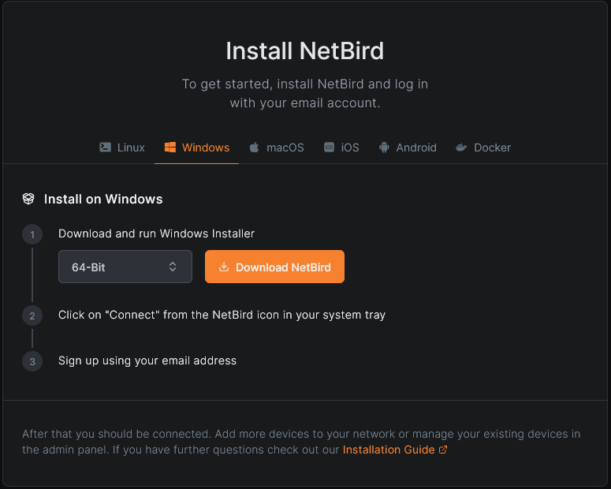
    </picture>

2. After installation, open the Netbird client. In the pop-up, switch to `Self-hosted`, enter your self-hosted Netbird URL, and click `Continue`.

    ```text
    https://vpn.example.com
    ```

    > NOTE: Use your actual Netbird VPN URL, or reach out to us at [ops@obmondo.com](mailto:ops@obmondo.com).

    <picture>
        <source media="(prefers-color-scheme: dark)" srcset="../images/netbird-switch-to-self-hosted.png">
        <source media="(prefers-color-scheme: light)" srcset="../images/netbird-switch-to-self-hosted.png">
        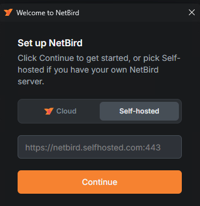
    </picture>

3. You can authenticate using your user account credentials by toggling the `Disconnected` switch, or connect via `Setup Keys` if connecting headless workstations or machines tied to specific network locations (`HQ`/`Cinema`). This guide covers connecting via `Setup Keys` hence leave the `Disconnected` toggle as-is.

    <picture>
        <source media="(prefers-color-scheme: dark)" srcset="../images/netbird-disconnected.png">
        <source media="(prefers-color-scheme: light)" srcset="../images/netbird-disconnected.png">
        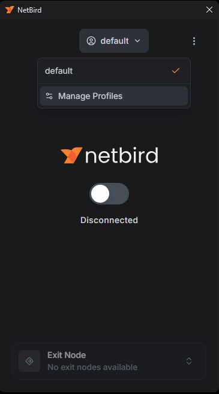
    </picture>

4. Open `PowerShell` and run the following command with your setup key:

    ```sh
    netbird up --setup-key "{setup-key}"
    ```

    <picture>
        <source media="(prefers-color-scheme: dark)" srcset="../images/netbird-connect-via-setup-key.png">
        <source media="(prefers-color-scheme: light)" srcset="../images/netbird-connect-via-setup-key.png">
        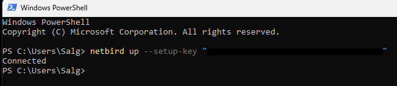
    </picture>

    > NOTE: Replace `{setup-key}` with your actual one-time setup key. Reach out to us at [ops@obmondo.com](mailto:ops@obmondo.com) to generate one.

5. Check the Netbird app to confirm status shows as `Connected`.

    <picture>
        <source media="(prefers-color-scheme: dark)" srcset="../images/netbird-connected.png">
        <source media="(prefers-color-scheme: light)" srcset="../images/netbird-connected.png">
        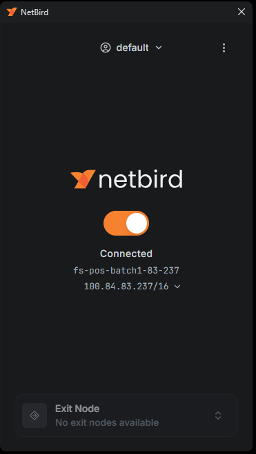
    </picture>

6. [Optional] View which networks and peers you can access by clicking the three dots icon at the top-right of the Netbird app and switching to `Advanced View`.

    <picture>
        <source media="(prefers-color-scheme: dark)" srcset="../images/netbird-advanced-view.png">
        <source media="(prefers-color-scheme: light)" srcset="../images/netbird-advanced-view.png">
        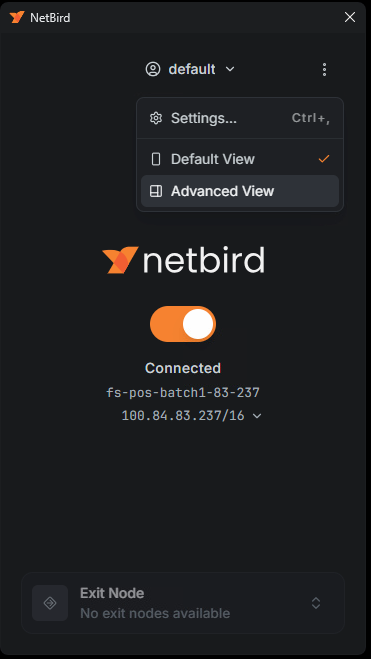
    </picture>
