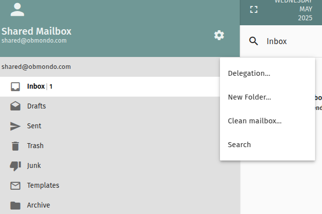
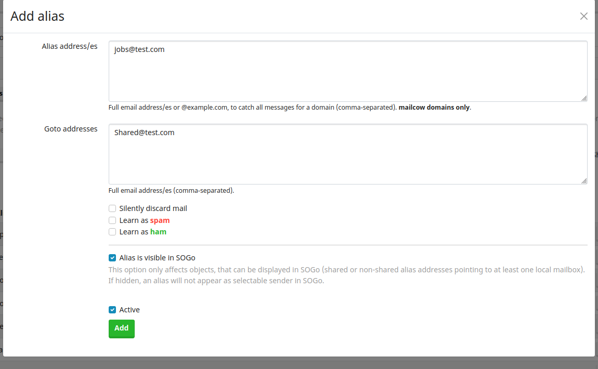

# Setup Mailserver using Mailcow

## Setup Keycloak in Mailcow

1. To add or edit your Identity Provider configuration, log in to your mailcow UI as administrator, go to System > Configuration > Access > Identity Provider and select Keycloak from the Identity Provider dropdown.
2. Create a `mailcow` client in keycloak
3. Update the fields based on your configurations.
4. An important thing to take care of is in the `Server Url` field, your url must be the keycloak URL followed by /auth like `https://keycloack.test.com/auth`
5. You can enable `Auto-create users on login` which will autocreate your mailbox in the mailcow when you login to your mailserver using keycloak, provided the user is already present and enabled in keycloak.

Notes - 

1. If we disable user in keycloak then user won't be able to login to mailcow but will continue getting mails
2. Make mailbox as inactive - if we don't want a user to get mails
3. Once mailbox is deactivated in mailcow - user can't even login to mailcow

## Setup a Shared mailbox in Mailcow

1. Create a shared mailbox in mailcow and login to that.
2. Add delegation for a user - then only you can share the folder and update perms

3. Once the delegation is added you can start to share it that users.

### Shared mailbox with multiple folders

1. You can create multile folders like `info`, `ops`, `jobs` etc in your shared mailbox and then share them across your team.

2. You can then write a filter rule so that if mail sent to your `jobs@test.com` it lands to your `jobs` folder.
Click on `Preferences ->Mail -> Filter`

3. You need to create a alias in mailcow so that any mails that gets sent to `jobs@test.com` goes to your shared mailbox like `shared@test.com`.
This you can do by logging as admin in mailcow and then `Email -> Configuration -> Aliases -> Add Alias`

