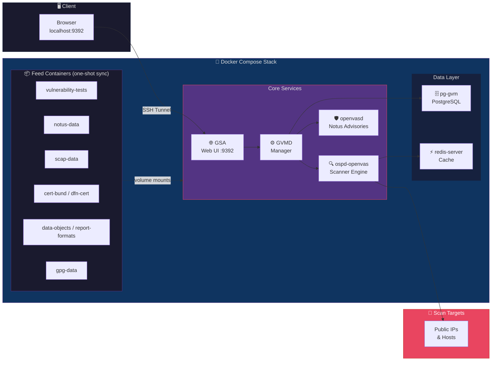

# OpenVAS (Greenbone Community Edition) — Setup & Usage Guide

LinuxAid provides a Puppet role (`role::scanner::openvas`) that deploys the full [Greenbone Community Edition](https://greenbone.github.io/docs/latest/) vulnerability scanner stack using Docker Compose. This guide covers deployment, configuration, and day-to-day usage.

---

## Table of Contents

1. [What Is OpenVAS?](#1-what-is-openvas)
2. [Architecture Overview](#2-architecture-overview)
3. [Deploying with LinuxAid](#3-deploying-with-linuxaid)
4. [Accessing the Web Interface](#4-accessing-the-web-interface)
5. [Understanding the Dashboard](#5-understanding-the-dashboard)
6. [Configuring Scan Targets](#6-configuring-scan-targets)
7. [Running a Scan](#7-running-a-scan)
8. [Scheduling Recurring Scans](#8-scheduling-recurring-scans)
9. [Reading Scan Results](#9-reading-scan-results)
10. [Exporting Reports](#10-exporting-reports)
11. [Managing Users](#11-managing-users)
12. [Administration & Maintenance](#12-administration--maintenance)
13. [Troubleshooting](#13-troubleshooting)
14. [Hiera Parameter Reference](#14-hiera-parameter-reference)

---

## 1. What Is OpenVAS?

OpenVAS (Open Vulnerability Assessment Scanner) is the scanner component of the Greenbone Community Edition. It checks your infrastructure for:

- **Accidentally exposed services** (e.g., a database port open to the internet)
- **Outdated software** with known security vulnerabilities (CVEs)
- **Weak SSL/TLS configurations**
- **Missing security patches**
- **Firewall misconfigurations**

It is designed to scan **public-facing IPs** to identify vulnerabilities before attackers do.

---

## 2. Architecture Overview

The LinuxAid OpenVAS deployment creates a full Greenbone Community Edition stack via Docker Compose:



| Component | Purpose |
|-----------|---------|
| **GSA** (Greenbone Security Assistant) | Web UI for managing scans and viewing results |
| **GVMD** (Greenbone Vulnerability Manager Daemon) | Central management service, orchestrates scans |
| **ospd-openvas** | The actual scanner engine that probes targets |
| **openvasd** | Handles Notus advisories for local security checks |
| **pg-gvm** | PostgreSQL database for scan data and results |
| **redis-server** | In-memory cache used by the scanner |
| **Feed containers** | One-shot containers that sync vulnerability data (CVEs, advisories) |

---

## 3. Deploying with LinuxAid

### Prerequisites

- A Linux server with Docker installed (LinuxAid manages Docker via `role::virtualization::docker`)
- At least **4 GB RAM** and **20 GB disk space** for the scanner and feed data
- Network access to `registry.community.greenbone.net` (to pull container images)

### Step 1: Add the Role to Your Node

In your Hiera data (node YAML file), add the `role::scanner::openvas` class:

```yaml
---
classes:
  - role::scanner::openvas
```

That's it for the basic deployment. LinuxAid will:

1. Create the install directory (`/opt/obmondo/docker-compose/openvas/`)
2. Generate a `docker-compose.yml` from a template with all component versions
3. Configure firewall rules to allow access to the web port
4. Start the Docker Compose stack

### Step 2: Run Puppet

Apply the Puppet catalog on the target node:

```bash
puppet agent -t
```

### Step 3: Wait for Feed Synchronization

On first startup, the feed containers download vulnerability data. This can take **10–30 minutes** depending on network speed.

Monitor container status:

```bash
sudo docker compose -f /opt/obmondo/docker-compose/openvas/docker-compose.yml -p openvas ps -a
```

> **Note**: Feed containers showing `Exited (0)` is **expected** — they run once to sync data and then stop. Only persistent services (gvmd, gsa, redis, pg-gvm, ospd-openvas) should show as `Up`.

---

## 4. Accessing the Web Interface

By default, the GSA web UI binds to `127.0.0.1:9392` (localhost only for security). You need an **SSH tunnel** to access it.

### Open SSH Tunnel

From your local machine:

```bash
ssh -L 9392:127.0.0.1:9392 <user>@<scanner-host>
```

Keep this terminal open — the tunnel stays active as long as the SSH session is running.

### Open in Browser

Navigate to:

```
http://localhost:9392
```

> ⚠️ **Use `http://` NOT `https://`** — GSA serves plain HTTP internally. The SSH tunnel provides encryption. If you see `ERR_SSL_PROTOCOL_ERROR`, you're accidentally using https.

### Default Admin Login

On first deployment, set the admin password via CLI:

```bash
sudo docker compose -f /opt/obmondo/docker-compose/openvas/docker-compose.yml -p openvas \
  exec -u gvmd gvmd gvmd --user=admin --new-password='<STRONG_PASSWORD>'
```

> 🔒 **Store the password securely** in your organization's password manager or secrets store.

---

## 5. Understanding the Dashboard

After logging in, you'll see the GSA dashboard with:

| Section | What It Shows |
|---------|--------------|
| **Scans → Tasks** | All configured scan tasks and their status (progress %, last run) |
| **Scans → Reports** | Completed scan reports with severity breakdown |
| **Configuration → Targets** | Servers/IPs being scanned |
| **Configuration → Schedules** | Automated scan schedules |
| **SecInfo** | Vulnerability database (CVEs, advisories) |

---

## 6. Configuring Scan Targets

### Creating a Target

1. Go to **Configuration → Targets** → Click ⭐ **New Target**
2. Fill in:

| Field | Description |
|-------|-------------|
| **Name** | A descriptive name (e.g., "Production Public IPs") |
| **Hosts** | Comma-separated list of IPs or CIDR ranges to scan |
| **Port List** | Select a port list (default: `All IANA Assigned TCP`) |

3. Click **Save**

### Best Practices

- **Only scan public IPs** — never add private addresses (`10.x.x.x`, `192.168.x.x`) unless you specifically need internal scanning
- **Group related hosts** into a single target for easier management
- **Use descriptive names** that identify what infrastructure is being scanned

### Resolving Hostnames to IPs

If you manage hostnames, resolve them to IPs before adding as targets:

```bash
dig +short <hostname>
```

---

## 7. Running a Scan

### Creating a Scan Task

1. Go to **Scans → Tasks** → Click ⭐ **New Task**
2. Fill in:

| Field | Recommended Value |
|-------|------------------|
| **Name** | Descriptive name (e.g., "Weekly Public IP Scan") |
| **Scan Targets** | Select your target |
| **Scanner** | OpenVAS Default |
| **Scan Config** | `Full and fast` *(recommended for regular scans)* |

3. Click **Save**, then **▶️ Play** to start

### Scan Config Options

| Config | Duration | When to Use |
|--------|----------|-------------|
| Discovery | ~10 min | Quick port/service inventory |
| **Full and fast** | **1–3 hours** | **Weekly scans (recommended)** |
| Full and fast ultimate | 3–6 hours | Monthly deep scans |
| Full and very deep | 6–12 hours | Quarterly compliance audits |

### What to Expect

- First scan duration depends on the number of target IPs
- Progress is **not linear** — the scanner spends more time on hosts with many open ports
- If stuck at the same % for over **1 hour**, check the [Troubleshooting](#13-troubleshooting) section

---

## 8. Scheduling Recurring Scans

A weekly scan is recommended to catch new vulnerabilities and configuration drift.

### Create a Schedule

1. Go to **Configuration → Schedules** → Click ⭐ **New Schedule**
2. Configure:

| Field | Recommended Value |
|-------|------------------|
| **Name** | `Weekly Sunday 2AM` |
| **First Run** | Next Sunday, 02:00 |
| **Period** | 1 week |
| **Timezone** | Your local timezone |
| **Duration** | 0 (no limit) |

3. Save

### Attach Schedule to a Task

1. Go to **Scans → Tasks**
2. Click the **✏️ pencil** icon on your scan task
3. Set **Schedule** → select your schedule
4. Save

---

## 9. Reading Scan Results

### Viewing Results

1. Go to **Scans → Reports**
2. Click on a completed report
3. Results are sorted by severity (most critical first)

### Severity Levels

| CVSS Score | Severity | Response Time |
|------------|----------|---------------|
| 9.0 – 10.0 | 🔴 **Critical** | Fix immediately — actively exploitable |
| 7.0 – 8.9 | 🔴 **High** | Fix within 24–48 hours |
| 4.0 – 6.9 | 🟡 **Medium** | Schedule fix in current sprint |
| 0.1 – 3.9 | 🟢 **Low** | Track for future cleanup |
| 0.0 | ⚪ **Log** | Informational — no action needed |

### What to Focus On

Prioritize findings that indicate **accidentally exposed services**:

1. **Unexpected open ports**:
   - Database ports: `3306` (MySQL), `5432` (PostgreSQL), `27017` (MongoDB)
   - Admin interfaces: `8080`, `8443`, `9090`
   - Internal services: `6379` (Redis), `11211` (Memcached), `9200` (Elasticsearch)

2. **Outdated software** with known CVEs

3. **Weak SSL/TLS configurations**

4. **Missing firewall rules**

---

## 10. Exporting Reports

1. Go to **Scans → Reports**
2. Select a completed report
3. Click the **⬇️ download** icon
4. Choose your format:

| Format | Best For |
|--------|----------|
| **PDF** | Sharing with team / management |
| **CSV** | Tracking in spreadsheets |
| **XML** | Automation / integration |

---

## 11. Managing Users

### Creating Users via Web UI

1. Go to **Administration → Users** → Click ⭐ **New User**
2. Fill in:

| Field | Value |
|-------|-------|
| **Login Name** | Employee's username |
| **Password** | Set a strong initial password |
| **Role** | `User` for read-only, `Admin` for full access |

3. Save

### Creating Users via CLI

```bash
# Create a read-only user
sudo docker compose -f /opt/obmondo/docker-compose/openvas/docker-compose.yml -p openvas \
  exec -u gvmd gvmd gvmd --create-user=<USERNAME> --password='<PASSWORD>' --role=User

# Create an admin user
sudo docker compose -f /opt/obmondo/docker-compose/openvas/docker-compose.yml -p openvas \
  exec -u gvmd gvmd gvmd --create-user=<USERNAME> --password='<PASSWORD>' --role=Admin
```

### Role Permissions

| Role | View Results | Export Reports | Run Scans | Manage Targets | Manage Users |
|------|:---:|:---:|:---:|:---:|:---:|
| **User** | ✅ | ✅ | ❌ | ❌ | ❌ |
| **Admin** | ✅ | ✅ | ✅ | ✅ | ✅ |

> 💡 Most users only need the **User** role — they can view scan results and export reports without risk of accidentally modifying scan configurations.

---

## 12. Administration & Maintenance

All commands are run on the scanner host via SSH.

### Check Container Status

```bash
sudo docker compose -f /opt/obmondo/docker-compose/openvas/docker-compose.yml -p openvas ps
```

### View Logs

```bash
# All services
sudo docker compose -f /opt/obmondo/docker-compose/openvas/docker-compose.yml -p openvas logs -f

# Specific service
sudo docker compose -f /opt/obmondo/docker-compose/openvas/docker-compose.yml -p openvas logs -f gvmd
```

### Stop / Start / Restart

```bash
# Stop (preserves data)
sudo docker compose -f /opt/obmondo/docker-compose/openvas/docker-compose.yml -p openvas stop

# Start
sudo docker compose -f /opt/obmondo/docker-compose/openvas/docker-compose.yml -p openvas start

# Restart
sudo docker compose -f /opt/obmondo/docker-compose/openvas/docker-compose.yml -p openvas restart
```

### Reset Admin Password

```bash
sudo docker compose -f /opt/obmondo/docker-compose/openvas/docker-compose.yml -p openvas \
  exec -u gvmd gvmd gvmd --user=admin --new-password='<NEW_PASSWORD>'
```

### Updating Vulnerability Feeds

**Preferred method**: Update via Puppet by bumping version numbers in your Hiera data:

```yaml
role::scanner::openvas::vulnerability_tests_version: '<NEW_VERSION>'
role::scanner::openvas::notus_data_version: '<NEW_VERSION>'
role::scanner::openvas::scap_data_version: '<NEW_VERSION>'
role::scanner::openvas::cert_bund_data_version: '<NEW_VERSION>'
role::scanner::openvas::dfn_cert_data_version: '<NEW_VERSION>'
role::scanner::openvas::data_objects_version: '<NEW_VERSION>'
role::scanner::openvas::report_formats_version: '<NEW_VERSION>'
role::scanner::openvas::gpg_data_version: '<NEW_VERSION>'
```

Then run `puppet agent -t` on the node.

**Manual method** (if urgent):

```bash
# Pull latest feed images
sudo docker compose -f /opt/obmondo/docker-compose/openvas/docker-compose.yml -p openvas pull \
  vulnerability-tests notus-data scap-data cert-bund-data dfn-cert-data data-objects report-formats gpg-data

# Run feed containers to sync
sudo docker compose -f /opt/obmondo/docker-compose/openvas/docker-compose.yml -p openvas up -d \
  vulnerability-tests notus-data scap-data cert-bund-data dfn-cert-data data-objects report-formats gpg-data
```

> ⚠️ **Important**: Always use `-p openvas` in all docker compose commands. The compose file has `name: greenbone-community-edition` internally, but Puppet manages it with project name `openvas`. Using the wrong project name will show empty results.

---

## 13. Troubleshooting

### Can't Access the Web UI

| Problem | Solution |
|---------|----------|
| Page won't load | Verify SSH tunnel is still open in your terminal |
| `ERR_SSL_PROTOCOL_ERROR` | Use `http://` NOT `https://` |
| Connection refused | Check GSA is running: `docker compose ... ps gsa` |
| Port not listening | Check on host: `sudo ss -tlnp \| grep 9392` |

### Scan Stuck at a Percentage

- **< 1 hour at the same %**: This is **normal**. OpenVAS progress is not linear.
- **> 1 hour at the same %**: Check scanner logs:

```bash
sudo docker compose -f /opt/obmondo/docker-compose/openvas/docker-compose.yml -p openvas \
  logs --tail 30 ospd-openvas
```

If logs show recent activity → scanner is still working, just slow.

If no recent activity → restart the scanner:

```bash
sudo docker compose -f /opt/obmondo/docker-compose/openvas/docker-compose.yml -p openvas \
  restart ospd-openvas
```

### Scan Stuck at 0%

```bash
# Check if scanner is registered with gvmd
sudo docker compose -f /opt/obmondo/docker-compose/openvas/docker-compose.yml -p openvas \
  exec -u gvmd gvmd gvmd --get-scanners
```

### Feed Sync Failed

```bash
# Find containers that exited with errors (non-zero exit code)
sudo docker compose -f /opt/obmondo/docker-compose/openvas/docker-compose.yml -p openvas ps -a | grep -v "Exited (0)"

# Restart failed feed containers
sudo docker compose -f /opt/obmondo/docker-compose/openvas/docker-compose.yml -p openvas up -d \
  vulnerability-tests notus-data scap-data
```

> ℹ️ Feed containers showing `Exited (0)` is **expected** — they run once to sync data and then stop.

---

## 14. Hiera Parameter Reference

All parameters are under the `role::scanner::openvas` namespace.

### Installation & Web Interface

| Parameter | Type | Default | Description |
|-----------|------|---------|-------------|
| `install_dir` | `Stdlib::Absolutepath` | `/opt/obmondo/docker-compose/openvas` | Installation directory |
| `install` | `Boolean` | `true` | Whether to install the scanner |
| `web_bind_address` | `Stdlib::Host` | `127.0.0.1` | Web UI bind address |
| `web_port` | `Stdlib::Port` | `9392` | Web UI port |

### Container Registry

| Parameter | Type | Default | Description |
|-----------|------|---------|-------------|
| `registry` | `String` | `registry.community.greenbone.net/community` | Docker registry for images |

### Component Versions

| Parameter | Default | Component |
|-----------|---------|-----------|
| `gsa_version` | `24.3.0` | GSA Web UI |
| `gvmd_version` | `25` | GVMD Manager |
| `openvas_scanner_version` | `23.15.4` | OpenVAS Scanner |
| `ospd_openvas_version` | `22.8.0` | OSP-OpenVAS |
| `gvm_tools_version` | `25` | GVM Tools |
| `pg_gvm_version` | `22.6.7` | PostgreSQL GVM |
| `redis_server_version` | `1.1.0` | Redis Server |

### Feed Versions

| Parameter | Default | Feed |
|-----------|---------|------|
| `vulnerability_tests_version` | `202502250742` | Vulnerability Tests (NVTs) |
| `notus_data_version` | `202502250410` | Notus Advisories |
| `scap_data_version` | `202502240506` | SCAP Data (CVEs) |
| `cert_bund_data_version` | `202502250409` | CERT-Bund Advisories |
| `dfn_cert_data_version` | `202502250401` | DFN-CERT Advisories |
| `data_objects_version` | `202502250505` | Data Objects |
| `report_formats_version` | `202502250500` | Report Formats |
| `gpg_data_version` | `1.1.0` | GPG Data |
| `feed_release_version` | `24.10` | Feed Release |

### Paths

| Parameter | Default | Description |
|-----------|---------|-------------|
| `data_mount_path` | `/mnt` | Data mount path inside containers |
| `gvm_data_path` | `/var/lib/gvm` | GVM data path |
| `openvas_plugins_path` | `/var/lib/openvas/plugins` | OpenVAS plugins path |
| `openvas_config_path` | `/etc/openvas` | OpenVAS configuration path |
| `openvas_log_path` | `/var/log/openvas` | OpenVAS log path |
| `notus_path` | `/var/lib/notus` | Notus data path |
| `storage_path` | `/var/lib/openvas/22.04/vt-data/nasl` | VT storage path |
| `redis_socket_path` | `/run/redis` | Redis socket path |
| `gvmd_socket_path` | `/run/gvmd` | GVMD socket path |
| `ospd_socket_path` | `/run/ospd` | OSPD socket path |
| `psql_data_path` | `/var/lib/postgresql` | PostgreSQL data path |
| `psql_socket_path` | `/var/run/postgresql` | PostgreSQL socket path |

### openvasd

| Parameter | Type | Default | Description |
|-----------|------|---------|-------------|
| `openvasd_mode` | `Enum['service_notus']` | `service_notus` | openvasd mode |
| `openvasd_addressport` | `Eit_types::AddressPort` | `0.0.0.0:80` | openvasd listen address |

### Automatic Hiera Defaults

When using `role::scanner::openvas`, the following Hiera data is automatically applied:

```yaml
common::network::firewall::enable_forwarding: true
common::network::firewall::allow_docker: true
```

---

## Puppet Code Structure

```
modules/enableit/
├── role/manifests/scanner/openvas.pp           # Role class (parameters & defaults)
├── profile/manifests/scanner/openvas.pp        # Profile class (implementation)
├── profile/templates/scanner/openvas/
│   └── docker-compose.yaml.epp                 # Docker Compose template
└── common/data/role/
    └── role::scanner::openvas.yaml             # Automatic Hiera data
```

---

## Further Reading

- [Greenbone Community Edition Documentation](https://greenbone.github.io/docs/latest/)
- [OpenVAS GitHub Repository](https://github.com/greenbone/openvas-scanner)
- [Greenbone Community Container Setup](https://greenbone.github.io/docs/latest/22.4/container/index.html)
