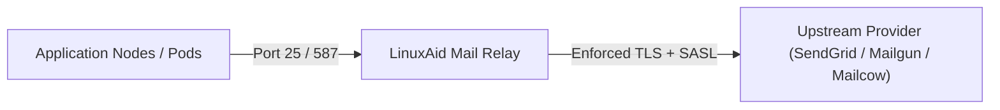

# Mail Relay Host Role (`role::mail::relayhost`)

The `role::mail::relayhost` module configures a secure outbound mail relay host for LinuxAid-managed servers, automating Postfix/Mailcow relay rules, SASL authentication, and TLS encryption.

## Overview

In enterprise environments, individual servers and application pods route outbound email (alerts, reports, transactional mail) through a centralized, authenticated mail relay. `role::mail::relayhost` provisions and manages Postfix relay daemon settings safely.



## Features

- **Centralized SMTP Routing**: Enforces standard outbound transport maps for internal servers.
- **SASL Credential Encryption**: Integrates with eyaml for storing relay passwords securely in Hiera.
- **TLS Encryption**: Enforces STARTTLS and certificate validation for outbound mail traffic.
- **Sender Restrictions**: Configures domain restrictions to prevent unauthorized spoofing.

## Configuration Options

Configure `role::mail::relayhost` in Hiera (`agents/<certname>.yaml`):

```yaml
classes:
  - role::mail::relayhost

role::mail::relayhost::relayhost: '[smtp.example.com]:587'
role::mail::relayhost::sasl_auth: true
role::mail::relayhost::sasl_user: 'relay@example.com'
role::mail::relayhost::sasl_password: 'ENC[PKCS7,...]'
role::mail::relayhost::mynetworks:
  - '127.0.0.0/8'
  - '10.0.0.0/8'
role::mail::relayhost::tls_enforce: true
```

## Verification

To verify outbound relay delivery on the host:

```sh
echo "Test message from LinuxAid relay" | mail -s "Relay Test" admin@example.com
tail -n 50 /var/log/mail.log
```
