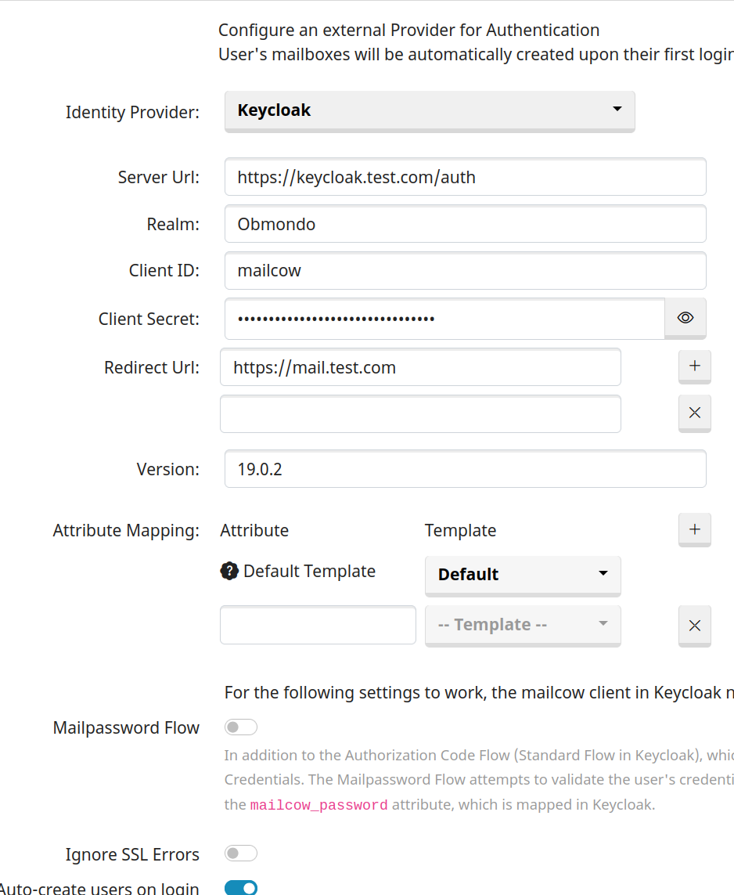
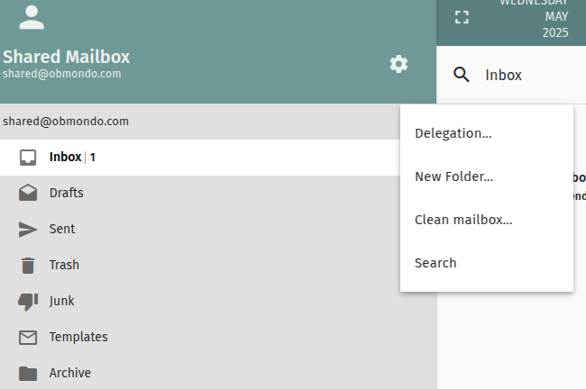
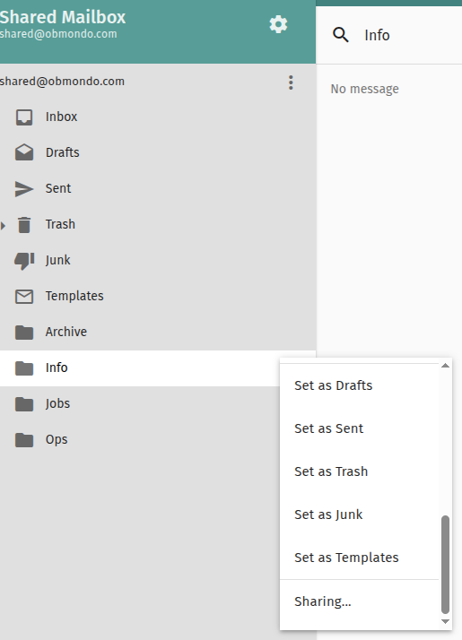
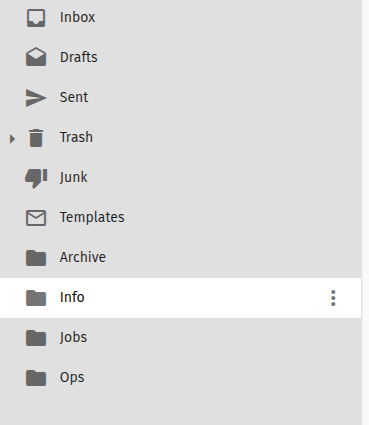
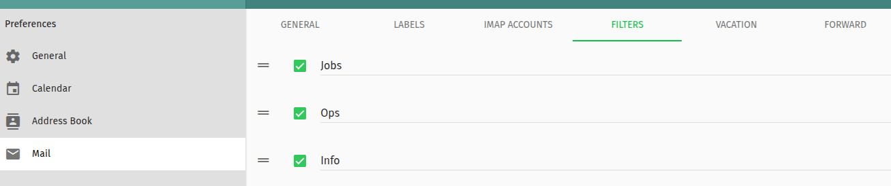
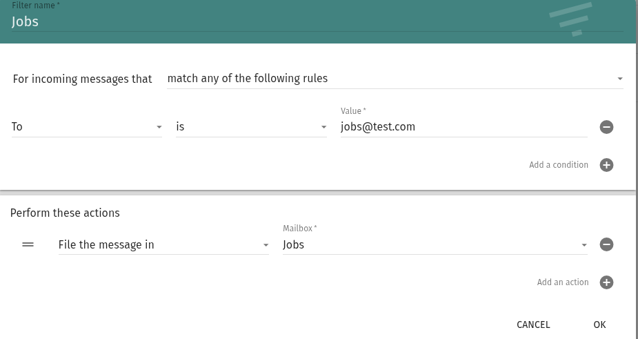
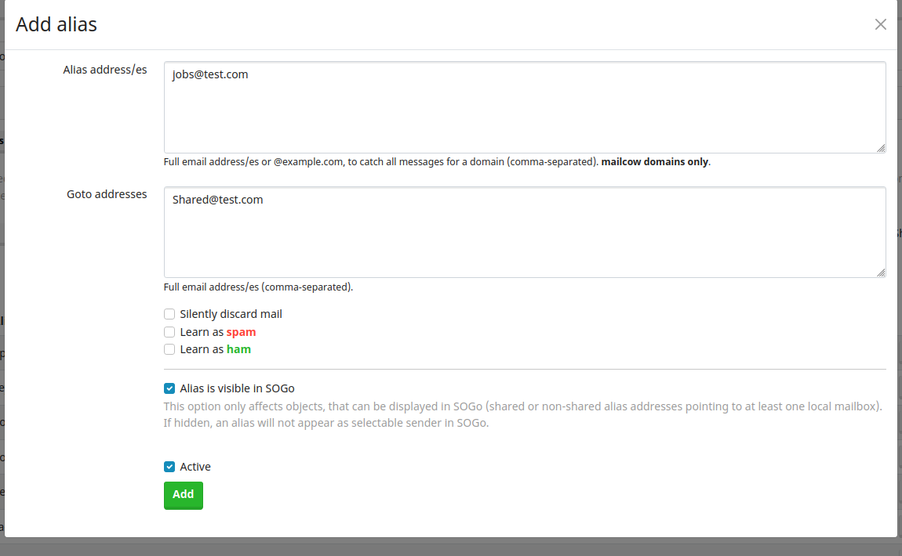
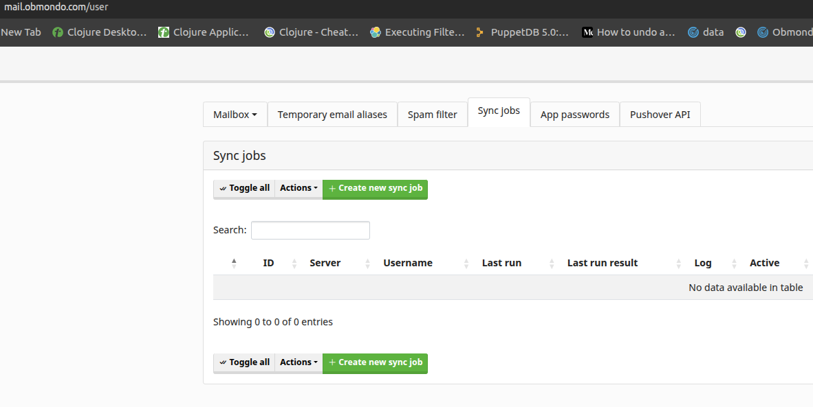
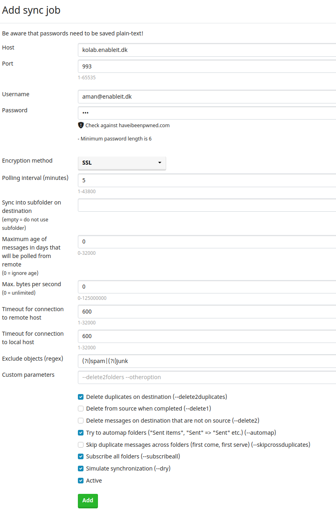

# Setup Mailserver using Mailcow

## Setup Keycloak in Mailcow

1. To add or edit your Identity Provider configuration, log in to your mailcow UI as administrator, go to System > Configuration > Access > Identity Provider and select Keycloak from the Identity Provider dropdown.
2. Create a `mailcow` client in keycloak
3. Update the fields based on your configurations.
4. An important thing to take care of is in the `Server Url` field, your url must be the keycloak URL followed by /auth like `https://keycloack.test.com/auth`
5. You can enable `Auto-create users on login` which will autocreate your mailbox in the mailcow when you login to your mailserver using keycloak, provided the user is already present and enabled in keycloak.



Notes -

1. If we disable user in keycloak then user won't be able to login to mailcow but will continue getting mails
2. Make mailbox as inactive - if we don't want a user to get mails
3. Once mailbox is deactivated in mailcow - user can't even login to mailcow

## Setup a Shared mailbox in Mailcow

1. Create a shared mailbox in mailcow and login to that.
2. Add delegation for a user - then only you can share the folder and update perms



3. Once the delegation is added you can start to share it that users.



### Shared mailbox with multiple folders

1. You can create multile folders like `info`, `ops`, `jobs` etc in your shared mailbox and then share them across your team.



2. You can then write a filter rule so that if mail sent to your `jobs@test.com` it lands to your `jobs` folder.
Click on `Preferences ->Mail -> Filter`





3. You need to create a alias in mailcow so that any mails that gets sent to `jobs@test.com` goes to your shared mailbox like `shared@test.com`.
This you can do by logging as admin in mailcow and then `Email -> Configuration -> Aliases -> Add Alias`



### Sync Mails from Kolab to Mailcow

1. Log in to [Mailcow](https://mail.obmondo.com/) using keycloak
2. Open https://mail.obmondo.com/user
3. Select `Sync Jobs`



4. Click on `Create new sync job`
5. Create a new sync job:
   - Set the **host** to `kolab.enableit.dk`.
   - Use **port** `993`.
   - Enter the **username** and **password** for `kolab.enableit.dk`.
   - Set the **polling interval** to **5 minutes** (this determines how often the job reruns).
   - Scroll down and click **Add** to create the sync job.



6. Wait for some time for the synchronization to start.
7. Click on **Open Logs** to check the logs while syncing emails.
8. Once the job is completed, the **Last Run Result** will show **Success**.

### Backup and Restore

#### Backup

Mailcow role already creates a service `mailcow-backup.service` and timer which takes the complete backup of mailcow daily at 2:15 AM.
By default the backup location is `/opt/mailcow` unless `role::mail::mailcow::backup_dir` is defined as some other location.

Backup directory will look something like

```bash
mailcow-2025-05-23-08-25-02  mailcow-2025-05-23-08-32-30  mailcow-2025-05-23-08-33-48  mailcow-2025-05-23-08-41-40  mailcow-2025-05-23-08-46-25
```

above is in format of date and time during which backup was started

You can even run a manual backup if necessary

```bash
MAILCOW_BACKUP_LOCATION=/opt/backup CREATE_BACKUP_LOCATION=yes /opt/obmondo/docker-compose/mailcow/helper-scripts/backup_and_restore.sh backup all
```

#### Restore

Run the `backup_and_restore.sh` script which is present in the `mailcow/helper-scripts/` folder.
mailcow is whee you have intialized/clone the mailcow directory.

Sample run

```bash
# MAILCOW_BACKUP_LOCATION=/opt/backup /opt/obmondo/docker-compose/mailcow/helper-scripts/backup_and_restore.sh restore

Using 1 Thread(s) for this run.
Notice: You can set the Thread count with the THREADS Variable before you run this script.
Using /opt/backup as backup/restore location.

Found project name mailcow
[ 1 ] - /opt/backup/mailcow-2025-05-23-08-25-02/
[ 2 ] - /opt/backup/mailcow-2025-05-23-08-32-30/
[ 3 ] - /opt/backup/mailcow-2025-05-23-08-33-48/
[ 4 ] - /opt/backup/mailcow-2025-05-23-08-41-40/
[ 5 ] - /opt/backup/mailcow-2025-05-23-08-46-25/

Select a restore point: 5

[ 0 ] - all
[ 1 ] - Mail directory (/var/vmail)
[ 2 ] - SQL DB
[ 3 ] - Rspamd data
[ 4 ] - Redis DB
[ 5 ] - Postfix data
[ 6 ] - Crypt data

Select a dataset to restore: 0

```
