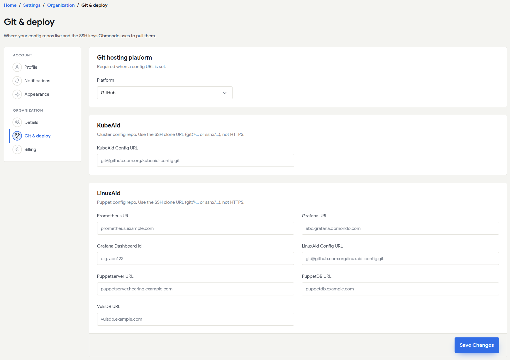
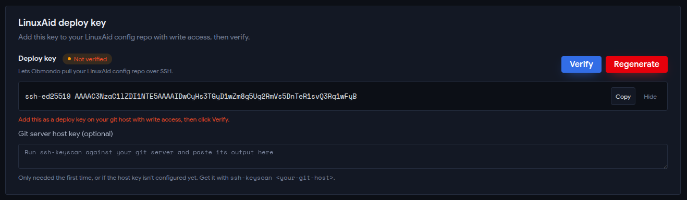
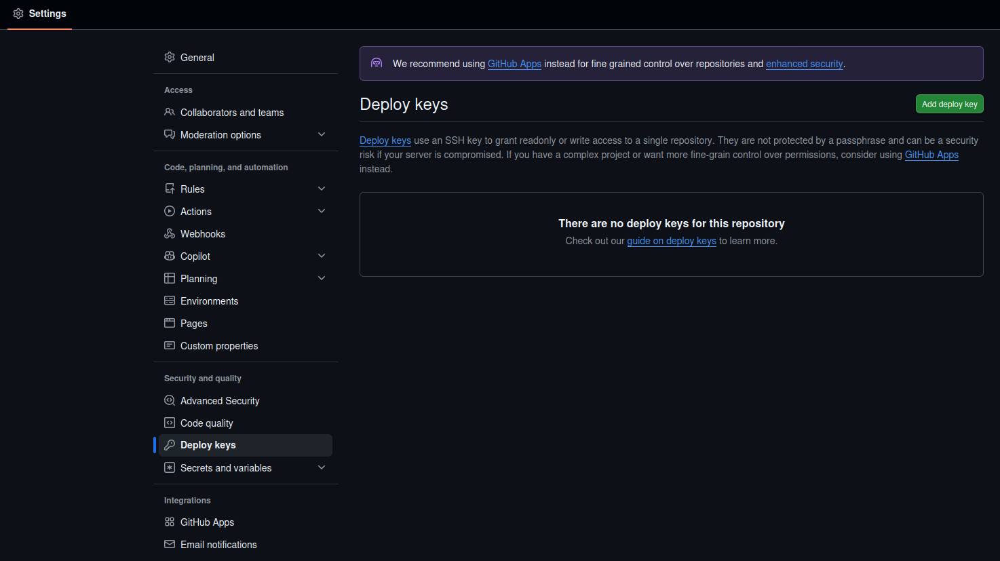
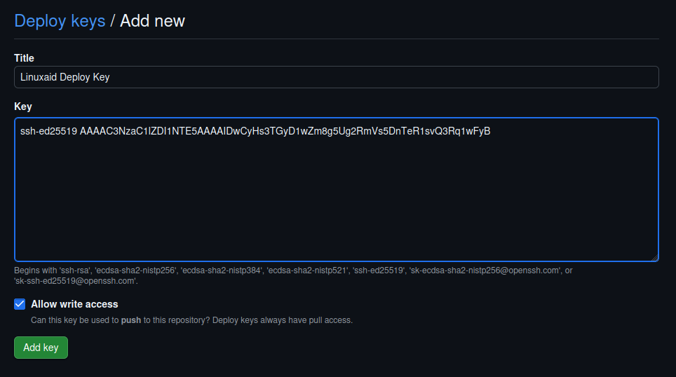
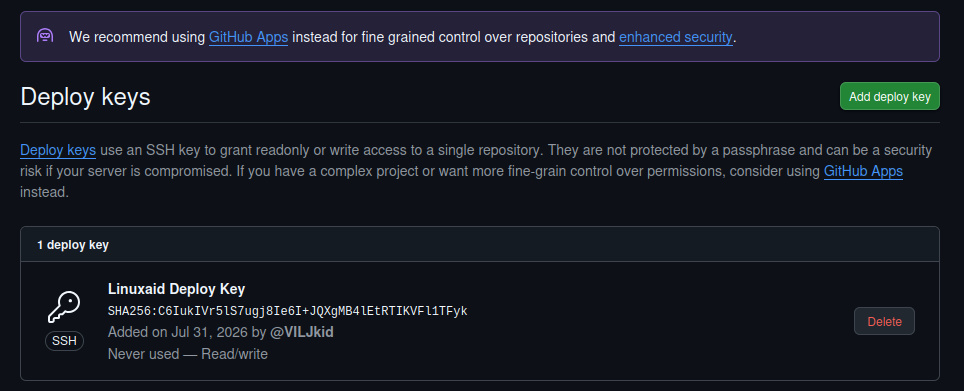
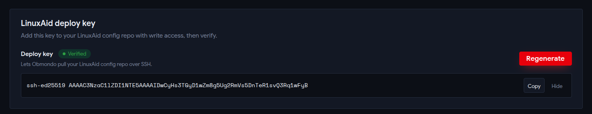

# Obmondo Customers: Git Setup

**Purpose:** This guide walks you through connecting your Git hosting platform to your Obmondo environment to enable seamless deployments.

## Prerequisites

* An active account on the Obmondo UI.
* A `linuxaid-config` repository in your Git hosting platform (e.g., GitHub).
* Your repository must contain at least one file.

## Phase 1: Configure in Obmondo UI

1. **Navigate to Git & Deploy:** Navigate directly to the [Git & Deploy page](https://obmondo.com/user/settings/organization/git-deploy).

    

2. **Select Platform:** Choose your `Git Hosting Platform`.

    

3. **Provide Config URL:** Enter your `Linuxaid Config URL` and click `Save Changes`.

    

4. **Generate SSH Key:** Locate the `Linuxaid Deploy Key` section and click `Generate SSH Key`.

    
    

### Deploy Key Already Generated

If you have already created one deploy key, and want to re-generate it, you can do so.
It will invalidate the previous one.

## Phase 2: Configure in your Git Repository

1. **Add Deploy Key:** In your `linuxaid-config` repository, go to **Settings** > **Deploy keys** > **Add deploy key**.
    

2. **Paste & Authorize:** Paste the SSH key you copied from Obmondo.
    > **Important:** Ensure that `Allow write access` is checked.

    
    

## Phase 3: Verification

1. **Verify Setup:** Return to the Obmondo UI and click `Verify`.
    > **Note:** Ensure that your git repo has at least 1 file present, or the verification will fail.

    
    
